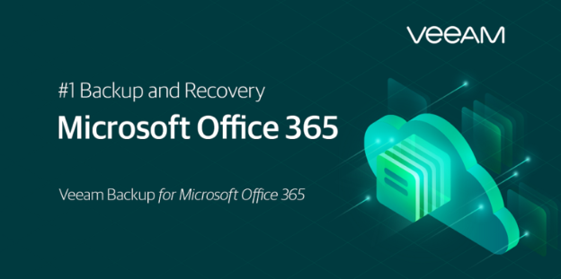
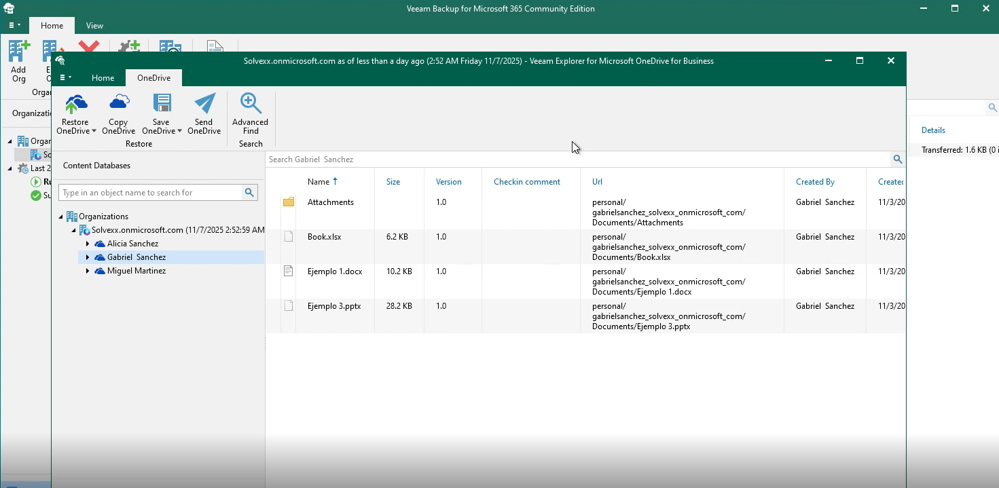
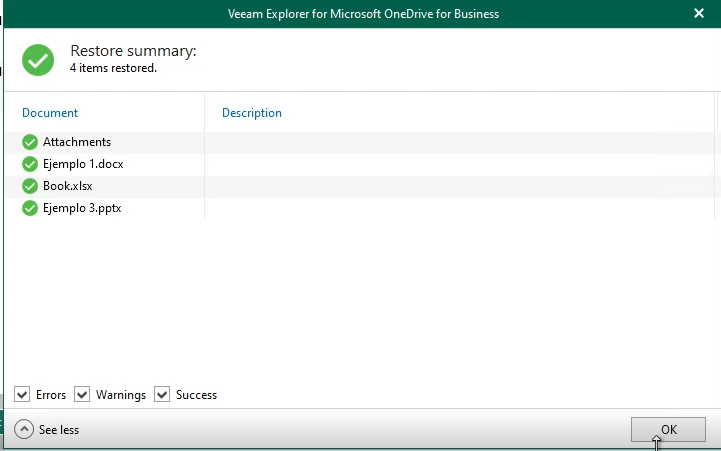
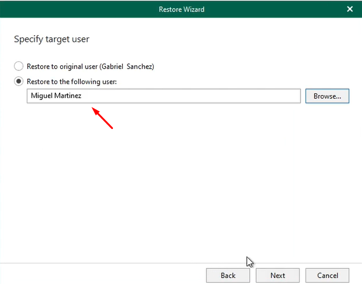

# Microsoft-Veam-Backup
This tool is highly powerful for Microsoft environments, where we have these products deployed on-premises alongside our users. Its implementation significantly facilitated the administration, protection, and recovery of files, optimizing response times in the event of incidents.

I consider it a robust and reliable solution that adds great value to operational continuity; therefore, in my opinion, it is a tool that every company should implement to ensure the security and availability of its information.

# Backup
In this screenshot, I performed a detailed exploration of OneDrive backups using the Veeam console. I accessed the tenant, navigated through the available accounts, and selected a user to review the stored information, including documents and folders.

As shown in the screenshot, the files were no longer available in the user’s account, as they had been completely removed, including from the recycle bin. Despite this, by using Veeam Explorer with administrative access, I was able to retrieve the backed-up data and successfully restore the affected items.

This demonstrates that even when data is no longer recoverable from the end-user environment, the solution enables full recovery from backup copies, ensuring administrative control and the protection of critical information.

## Restore
In this step of the restoration process, we have the option to restore the deleted files either to the original user’s account or to a different user account, as long as that user is already added to the tenant and has the necessary licenses assigned.

This flexibility is useful in scenarios where the original user account may no longer be available, or if the data needs to be transferred to another user within the organization. The ability to specify the target user ensures controlled and efficient data recovery, while maintaining the integrity and compliance of the organization’s backup policies.

## 📚 Learn More

If you want to dive deeper into backup and restore features for Microsoft 365, including OneDrive and SharePoint, check out the official Microsoft documentation for detailed guides and best practices:

https://learn.microsoft.com/en-us/microsoft-365/backup/backup-restore-data?view=o365-worldwide&utm_source=chatgpt.com
